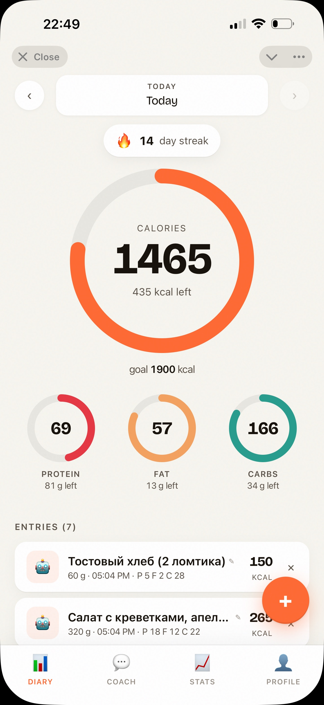
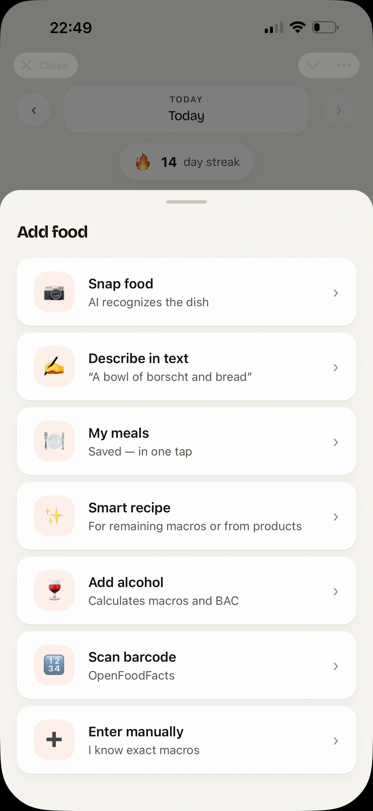
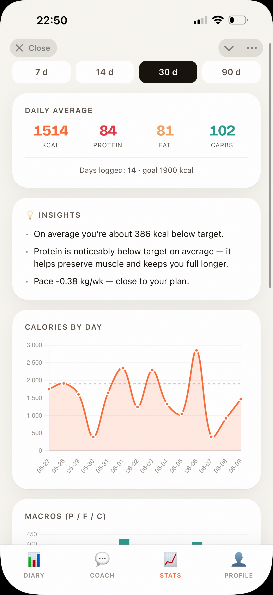
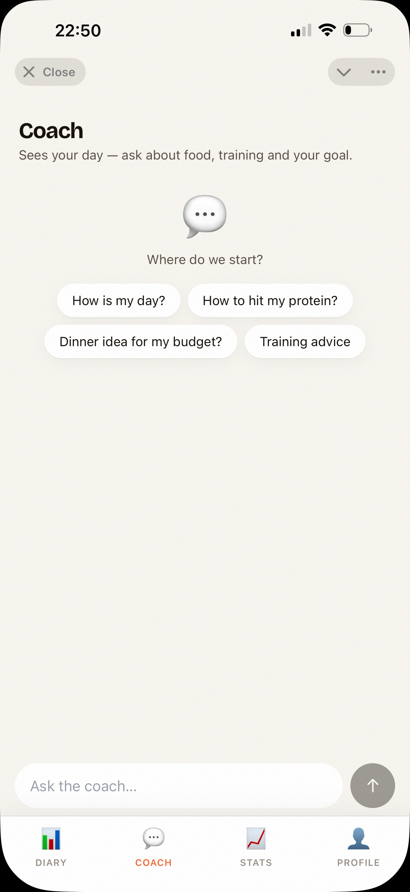
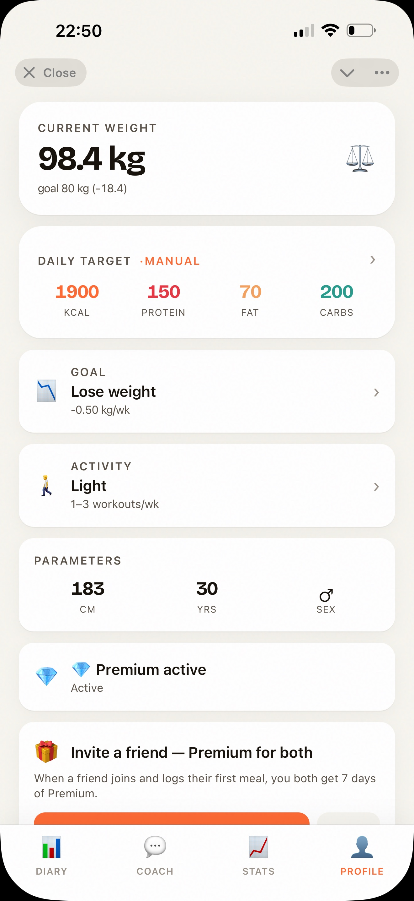

# Kcaly — Calorie & Macro Tracker (Telegram Mini App)

> A fully-featured nutrition tracking Mini App + bot built solo from zero to production. Telegram-native — no separate app install required.

🤖 **Try it:** [@mycalories420_bot](https://t.me/mycalories420_bot)

---

## Screenshots

  
  
  
  
  

---

## Overview

Kcaly is a production Telegram Mini App for tracking calories and macronutrients (КБЖУ). The product runs entirely inside Telegram — a full React SPA embedded in WebView, backed by a Python/FastAPI API and SQLite database. Built and launched solo, including product design, backend, frontend, infrastructure, and monetization.

**Architecture philosophy:** thin bot (start, quick log, payments, commands) + thick client (all product logic in the Mini App). Deterministic math (macros, BAC, weight forecast) runs in code; AI only where it adds real value.

---

## Tech Stack

| Layer | Technologies |
|---|---|
| **Backend** | Python 3.12, FastAPI, Uvicorn |
| **Bot** | python-telegram-bot 22.7 |
| **Frontend** | React + Babel-standalone (JSX in browser), Tailwind CSS (CDN), Telegram Web App SDK |
| **Database** | SQLite + aiosqlite (raw SQL, no ORM) |
| **AI** | Anthropic Claude API (`AsyncAnthropic`) — food recognition, recipes, coach, analytics |
| **Integrations** | OpenFoodFacts (barcode), Telegram Stars (payments), httpx |
| **Infrastructure** | Hetzner VPS (Ubuntu 24.04), Caddy (auto-HTTPS), systemd, deploy via `./deploy.sh` |

Bot and API run in a **single process**. Frontend is a single compiled `index.html` served via FastAPI.

---

## Features

### 🍽️ Food Logging — 7 Methods
- **Snap food** — AI recognizes the dish from a photo (Claude Vision)
- **Describe in text** — natural language ("a bowl of borscht and bread")
- **Scan barcode** — via OpenFoodFacts database
- **My meals** — saved templates, one-tap logging
- **Smart recipe** — AI-generated recipe based on remaining macros (Premium)
- **Add alcohol** — calculates macros + BAC (Premium)
- **Enter manually** — exact macro values

### 📊 Stats & Insights
- Daily calorie ring + macro rings with progress
- Calorie chart by day, macro chart (Premium)
- AI insights: daily average, pace vs goal, personalized tips
- Streak tracking (🔥 14 day streak)
- Weight tracker + weight forecast (Premium)

### 🤖 AI Coach (Claude API)
- Sees the user's full logged day — asks about food, training, goals
- Free tier: 5 sessions/week. Premium: unlimited
- Pre-set prompts + free-form chat

### 💰 Monetization (Telegram Stars)
- Recurring subscription — 249 ⭐/month
- Three access tiers: free-unlimited / free-metered AI / premium-only
- Full payment flow: invoices, pre-checkout, success handler, `/refund`
- AI cost optimization: dedicated model per feature + prompt caching
- Global AI kill switch + per-feature call limits

### 🎁 Referral System
- Both referrer and friend get Premium days
- Reward triggers on friend's **first meal logged** (not just signup)
- Anti-abuse cap: `REFERRAL_MAX_REWARDS=4` per referrer
- `/invite` command + referral card in Mini App

### 📈 Growth & Analytics
- Traffic source tracking via `?start=src_…` → per-platform breakdown in `/metrics`
- Admin dashboard: DAU/WAU/MAU, AI usage by feature, paywall hits, Stars balance, conversion funnel
- `/report` — AI analyst (Claude) generates a written metrics report
- `/announce` — broadcast release notes to all users

### 🌍 Other
- Bilingual **RU / EN** (i18n throughout)
- Customizable water goal + Water Tracker
- In-app feedback form (bug / idea / other) → admin Telegram notification
- Full onboarding inside Mini App
- `/privacy` command
- `NumField` custom component — fixes numeric input bugs across all fields
- Safe-area support for fullscreen mode

---

## Infrastructure

- **VPS:** Hetzner (Ubuntu 24.04)
- **Domain:** `https://mybot-foodlog.cc`, Mini App at `/app`
- **Reverse proxy:** Caddy with auto-HTTPS → `localhost:8000`
- **Process manager:** systemd service `calorie-bot`
- **Deploy:** `./deploy.sh` — rsync sources (excluding `.env`, `*.db`, `venv`) + SSH service restart
- **Secrets:** `.env` lives only on server, never in sync

---

## What I Built

End-to-end solo project:

- Designed product, UX, and onboarding flow from scratch
- Built Python/FastAPI backend + Telegram bot (handlers, payments, admin commands)
- Built React Mini App frontend — all components custom (no UI library)
- Designed SQLite schema with incremental migrations (raw SQL)
- Integrated Claude API for food recognition, coaching, recipe generation, and analytics
- Implemented full Telegram Stars subscription flow with refunds
- Built referral system with bilateral rewards and anti-abuse logic
- Implemented per-platform traffic source tracking and admin metrics dashboard
- Set up Hetzner VPS, Caddy reverse proxy, systemd service, and automated deploy pipeline
- Shipped v1.0 and iterated based on real user feedback

---

## Status

✅ **Live in production** — [@mycalories420_bot](https://t.me/mycalories420_bot)
